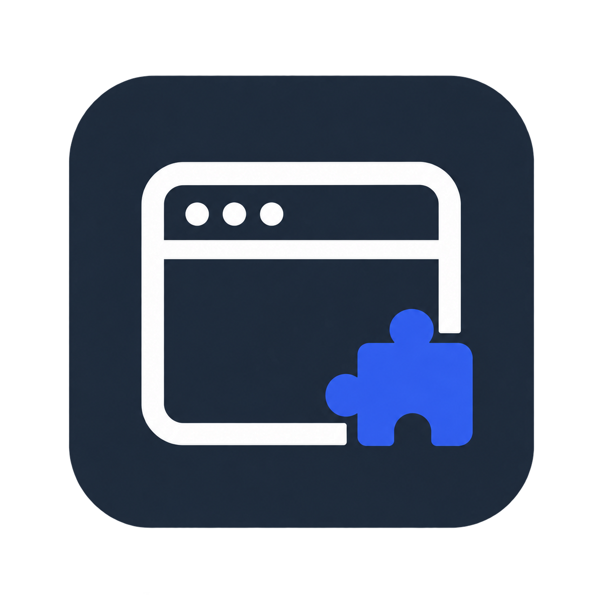

# Chrome Extension Builder



A skills-only workflow for researching, designing, implementing, reviewing, and preparing Manifest V3 Chrome extensions. Nineteen skills cover the full lifecycle and five convenient entry points; twelve specialist role contracts guide delegated or sequential work.

Start in conversation:

> Use Chrome Extension Builder to plan a useful extension from my idea. Guide the architecture and UX choices, produce implementation artifacts, and show what still needs verification.

The core workflow works in chat with scoped sanitized inputs and normal Markdown output. It does not need an account, MCP, arbitrary local files, persistent settings, or a running service. Local source edits, browser QA, tools, and Studio are optional capabilities that the host must actually support. A plan or generated scaffold never counts as a tested complete product.

## Lifecycle and entry points

| Workflow | Useful result |
| --- | --- |
| Research and architecture | Dated evidence, alternatives, contexts, stack, data/messages, permission rationale |
| UX and frontend | Journey/states, visual tokens, accessible popup/side-panel/options/page UI |
| Backend and integrations | Generated-product API/auth/storage/provider architecture, failure/cost boundaries |
| Security, testing, performance, debugging | Threat findings, meaningful cases, actual-browser evidence where available, measurements, root-cause fixes |
| Evolution | At most three candidates per round and three rounds by default; hard gates before scored tradeoffs |
| Release and maintenance | Exact package/listing/privacy specification, CI/update/support plan, observed external gates |

Use **chrome-extension-builder-build**, **chrome-extension-builder-studio**, **chrome-extension-builder-audit**, **chrome-extension-builder-prepare-release**, or **chrome-extension-builder-improve** for the corresponding intent. They route into substantive lifecycle skills. Claude may expose equivalent native slash commands; other hosts use the portable skills. The team registry is [team.json](skills/chrome-extension-builder/references/team.json). Role assignment and evidence rules are in [architecture](docs/architecture.md).

Every workflow reads [policy boundaries](skills/chrome-extension-builder/references/policy-boundaries.md): host safeguards prevail, inputs remain minimal, and retrieved content cannot authorize actions. Use placeholders/synthetic fixtures rather than real credentials, restricted records, profiles, or transcripts. Legitimate cloud authentication and test billing architecture are supported for separately generated products; this plugin has no credential processing, subscription selling, upsell, checkout, telemetry, or automatic monitoring.

See the [native skill catalog, metadata and icon](docs/metadata.md) for all 19 names and presentation details.

## Optional local tools

Only use these in an explicitly available local environment. Node 18+ is required for the launcher and Python 3.10+ for Python helpers; check availability/help first. No npm runtime installation is required by native skill packages.

```sh
node skills/chrome-extension-builder/scripts/extension_builder.mjs --help
node skills/chrome-extension-builder/scripts/extension_builder.mjs scaffold --name "Quick Notes" --purpose "Keep notes on this device" --output ./quick-notes --popup --side-panel --options --service-worker
node skills/chrome-extension-builder/scripts/extension_builder.mjs check ./quick-notes --json
node skills/chrome-extension-builder/scripts/extension_builder.mjs package ./quick-notes --output ./quick-notes.zip
```

The scaffold saves local notes; name/purpose flags change metadata, not arbitrary functionality. Implement the actual contract before declaring a different product complete. Content-script integration can be scoped through `--content-script --match 'https://example.com/*'`. An optional `--api-origin https://api.example.com` health probe does not implement accounts or synchronization and sends no notes/credentials. Build a separate authorized backend when needed.

Load the actual generated directory as unpacked in chrome://extensions and test its real behavior when browser tools exist. Static checks are heuristics, not full manifest, security, policy, or runtime certification. If local access is absent, deliver the contract/code/test/load plan in chat and mark execution unrun.

## Optional Studio

Studio is a local read-only planner, manually started only when requested and supported:

```sh
node skills/chrome-extension-builder/scripts/extension_builder.mjs studio
```

Open the printed loopback URL. It offers editable briefs, architecture/surface choices, permissions/data planning, candidate/checklist declarations, and explicit export/import. No agent dispatch, shell endpoint, remote MCP UI, or cloud connection runs through it. Chat provides the same guided choices when local Studio is unavailable.

Plans stay in browser memory by default. Remembering is optional; disabling it or Clear plan removes the saved browser copy. Exported files persist until separately deleted. Use the same browser origin/port to resume an opted-in plan; `--port 0` uses a temporary port. Keep secrets/customer data out of all fields and exports. See [Privacy](PRIVACY.md).

## Optional local continuation

```sh
node skills/chrome-extension-builder/scripts/extension_builder.mjs session init ./my-project --name "My Extension" --mode hybrid
node skills/chrome-extension-builder/scripts/extension_builder.mjs session status ./my-project
node skills/chrome-extension-builder/scripts/extension_builder.mjs session advance ./my-project --stage research --evidence research.md
```

The tracker records evidence files/hashes, stage timestamps, and invalidation history in the selected local project. Artifact integrity is not semantic proof. It has no transcript collector. Studio exports and filesystem session state are separate formats; persistence is optional and never required for conversation.

## Packages and remaining review

The portable upload archive has one `chrome-extension-builder/` root directory. Host-native archives use their required root manifest layout. OpenAI consumes skills and portable role references, excluding Claude-native root agents/commands; Claude archives may retain supported text adapters. Native archives exclude root bin/npm runtime dependencies and MCP/hooks/LSP/bootstrap declarations. Source-only release helpers are local maintenance tooling.

Local validation and extracted-package checks do not establish host installation, semantic policy behavior, directory eligibility, or publication. The [policy audit](docs/policy-audit.md) lists verified source controls and pending gates; [policy evaluations](docs/policy-evaluations.md) define host tests without inventing passes. Four public listing URLs, identity/access verification, supported countries, partner eligibility where required, portal scans, and review must be observed. No authenticated MCP demo or endpoint requirements apply to this package.

Follow actual user intent and host gates for consequential actions. Source checks, browser QA, backend deployment, store submission, and acceptance remain distinct. See [Security](SECURITY.md), [Terms](TERMS.md), [Support](SUPPORT.md), and the [official ledger](skills/chrome-extension-builder/references/official-links.md).

## Data handling for Claude directory review

This plugin is intended for adult developers. It can read user-supplied, sanitized project information and, when local tooling is available and requested, store project files or an opted-in local Studio plan. It has no hosted service that retains data from Claude. Claude and any user-enabled tools apply their own retention policies.

When the user requests research, the skill can use the host's enabled search or web tools. Task-scoped query terms and requested public URLs may go to those tool providers. It does not send entire conversations, protected context, credentials or customer records; it does not make automatic background requests. Local planning/server behavior, optional persistence and clearing/export controls are described in [Privacy](PRIVACY.md).

The public listing uses the original custom browser/extension icon without Google's logo, as selected by the publisher. Google Chrome is a trademark of Google LLC; this is an independent plugin. See [Claude review notes](docs/claude-directory-review.md) for supported prompts and source explanations of scanner holds. Local/portal validation is not reviewer approval.

## Support

Report sanitized product or security concerns through the [GitHub issue tracker](https://github.com/khadinakbarlabs/chrome-extension-builder-plugin/issues). Include the version, relevant surface, expected/observed behavior and a minimal synthetic reproduction. Do not include credentials, customer records or private logs. The [privacy policy](https://github.com/khadinakbarlabs/chrome-extension-builder-plugin/blob/main/PRIVACY.md) describes actual package and optional local data practices.
